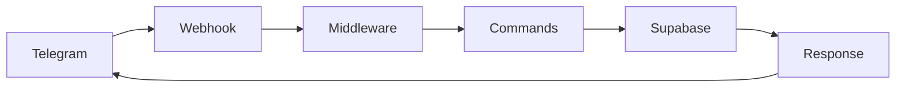

# 🚀 ZettiBot

**Assistente Digital de Vendas para Telegram**

*Transforme caos em estratégia e potencialize seus resultados comerciais*


---

## 📋 Sobre o Projeto

ZettiBot é um assistente digital inovador desenvolvido especificamente para vendedores externos. Através do Telegram, oferece uma suite completa de ferramentas para gestão de clientes, agenda, follow-ups e otimização de rotas comerciais.

### 🎯 **Principais Funcionalidades**

- 👥 **Gestão de Clientes** - CRUD completo com validações e busca avançada
- 📅 **Agenda Inteligente** - Compromissos com lembretes e notificações
- 📊 **Follow-up de Leads** - Acompanhamento de negociações em tempo real
- 🗺️ **Otimização de Rotas** - Planejamento inteligente de visitas
- 📈 **Relatórios e Analytics** - Métricas de performance de vendas
- 🔔 **Lembretes Personalizados** - Notificações estratégicas

### ✨ **Diferenciais**

- **Interface Conversacional** - Interação natural via Telegram
- **Offline-First** - Funciona mesmo com conectividade limitada  
- **Multi-etapas** - Conversas inteligentes que guiam o usuário
- **Validações Robustas** - Garantia de qualidade dos dados
- **Arquitetura Modular** - Código limpo e escalável

---

## 🛠️ Stack Tecnológica

| Tecnologia | Versão | Propósito |
|------------|--------|-----------|
| **Next.js** | 14.0.2 | Framework React para API |
| **TypeScript** | 5.2.2 | Tipagem estática |
| **Supabase** | Latest | Banco PostgreSQL + Auth |
| **Telegraf** | 4.15.0 | SDK Telegram Bot API |
| **Vercel** | - | Deploy e hospedagem |
| **date-fns** | 2.30.0 | Manipulação de datas |
| **Zod** | 3.22.4 | Validação de schemas |

---

## 🚀 Início Rápido

### 📋 **Pré-requisitos**

- Node.js 18+ 
- npm ou yarn
- Conta no Supabase
- Bot Token do Telegram
- Conta na Vercel (para deploy)

### ⚡ **Instalação Local**

```bash
# 1. Clone o repositório
git clone https://github.com/rafak1ngz/ZettiBot.git
cd ZettiBot

# 2. Instale as dependências
npm install

# 3. Configure as variáveis de ambiente
cp .env.example .env.local
# Edite o .env.local com suas chaves

# 4. Execute em desenvolvimento
npm run dev
```

### 🔧 **Configuração das Variáveis**

```env
# Telegram Bot
TELEGRAM_BOT_TOKEN=seu_bot_token_aqui
WEBHOOK_URL=https://seu-dominio.vercel.app
WEBHOOK_SECURITY_KEY=chave_secreta_unica

# Supabase
NEXT_PUBLIC_SUPABASE_URL=https://seu-projeto.supabase.co
NEXT_PUBLIC_SUPABASE_ANON_KEY=sua_chave_publica
SUPABASE_SERVICE_ROLE_KEY=sua_chave_privada
```

### 🚀 **Deploy na Vercel**

```bash
# 1. Instale a CLI da Vercel
npm i -g vercel

# 2. Faça login e configure
vercel login
vercel

# 3. Configure as variáveis de ambiente no dashboard da Vercel

# 4. Configure o webhook do Telegram
curl -X POST "https://api.telegram.org/bot{SEU_TOKEN}/setWebhook" \
     -H "Content-Type: application/json" \
     -d '{"url": "https://seu-app.vercel.app/api/telegram/webhook"}'
```

---

## 📱 Como Usar

### 🎬 **Primeiros Passos**

1. **Inicie uma conversa** com @SeuZettiBotNo Telegram
2. **Digite `/start`** para criar sua conta
3. **Forneça seu email** quando solicitado
4. **Explore o menu principal** e suas funcionalidades

### 📋 **Comandos Disponíveis**

| Comando | Descrição |
|---------|-----------|
| `/start` ou `/inicio` | Iniciar ou criar conta |
| `/ajuda` | Lista todos os comandos |
| `/clientes` | Gerenciar base de clientes |
| `/agenda` | Organizar compromissos |
| `/followup` | Acompanhar leads |
| `/lembrete` | Criar alertas |
| `/cancelar` | Cancelar operação atual |

### 🔄 **Fluxos Principais**

**Adicionar Cliente:**
1. `/clientes` → "Adicionar novo cliente"
2. Informe: Nome da empresa → CNPJ → Contato → Telefone → Email
3. Confirme os dados e salve

**Agendar Compromisso:**
1. `/agenda` → "Novo Compromisso"
2. Escolha vincular a cliente ou não
3. Defina: Título → Data → Hora → Local
4. Confirme o agendamento

---

## 🏗️ Arquitetura

### 📁 **Estrutura do Projeto**

```
src/
├── lib/telegram/                # Core do bot
│   ├── index.ts                # Bot principal
│   ├── middleware/             # Middlewares
│   │   ├── user.ts            # Autenticação
│   │   └── conversation/      # Processamento de conversas
│   └── commands/              # Comandos do bot
│       ├── menu/              # Navegação
│       ├── clientes/          # Gestão de clientes
│       ├── agenda/            # Gestão de agenda
│       └── shared/            # Utilitários
├── types/                     # Interfaces TypeScript
├── utils/                     # Validadores e helpers
└── pages/api/telegram/        # Endpoints da API
```

### 🔄 **Fluxo de Dados**



---

## 🧪 Desenvolvimento

### 🔧 **Scripts Disponíveis**

```bash
npm run dev          # Servidor de desenvolvimento
npm run build        # Build de produção  
npm run start        # Servidor de produção
npm run lint         # Linter ESLint
npm run type-check   # Verificação TypeScript
```

### 🧪 **Testando Localmente**

```bash
# 1. Use ngrok para expor porta local
npx ngrok http 3000

# 2. Configure webhook temporário
curl -X POST "https://api.telegram.org/bot{TOKEN}/setWebhook" \
     -d "url=https://seu-ngrok-url.ngrok.io/api/telegram/webhook"

# 3. Teste no Telegram
```

### 🔍 **Debug e Logs**

- Logs detalhados no console durante desenvolvimento
- Supabase Dashboard para monitorar banco de dados
- Vercel Dashboard para logs de produção

---

## 🤝 Contribuindo

Contribuições são bem-vindas! Por favor:

1. **Fork** o projeto
2. **Crie uma branch** para sua feature (`git checkout -b feature/AmazingFeature`)
3. **Commit** suas mudanças (`git commit -m 'Add some AmazingFeature'`)
4. **Push** para a branch (`git push origin feature/AmazingFeature`)
5. **Abra um Pull Request**

### 📋 **Diretrizes de Contribuição**

- Siga os padrões de código TypeScript
- Mantenha a arquitetura modular
- Adicione testes quando necessário
- Documente novas funcionalidades
- Siga os padrões de commit convencionais

---

## 📄 Licença

Este projeto está sob a licença MIT. Veja o arquivo [LICENSE](LICENSE) para detalhes.

---

## 📞 Suporte

- 📧 **Email**: contato@zettibot.com
- 💬 **Telegram**: @ZettiBotSupport  
- 🐛 **Issues**: [GitHub Issues](https://github.com/rafak1ngz/ZettiBot/issues)
- 📖 **Documentação**: [Docs Completa](https://docs.zettibot.com)

---

## 🎯 Roadmap

### ✅ **Concluído**
- [x] Sistema de usuários e autenticação
- [x] CRUD completo de clientes
- [x] Menu de navegação intuitivo
- [x] Validações robustas de dados
- [x] Arquitetura modular

### 🔄 **Em Desenvolvimento**
- [ ] Sistema de agenda completo
- [ ] Follow-up de leads
- [ ] Relatórios e analytics
- [ ] Sistema de lembretes

### 🔮 **Futuro**
- [ ] Dashboard web administrativo
- [ ] Integração com CRM externos
- [ ] API pública para integrações
- [ ] App mobile nativo
- [ ] Inteligência artificial para insights

---

## 🙏 Agradecimentos

- **Equipe Telegram** pela excelente Bot API
- **Vercel** pela plataforma de deploy gratuita
- **Supabase** pelo backend completo
- **Comunidade Open Source** pelas bibliotecas incríveis

---

<div align="center">

**Desenvolvido com ❤️ por [Rafael King](https://github.com/rafak1ngz)**

**ZettiBot** - *Transformando caos em estratégia desde 2024*

[⭐ Star no GitHub](https://github.com/rafak1ngz/ZettiBot) • [🐛 Reportar Bug](https://github.com/rafak1ngz/ZettiBot/issues) • [💡 Sugerir Feature](https://github.com/rafak1ngz/ZettiBot/issues)

</div>