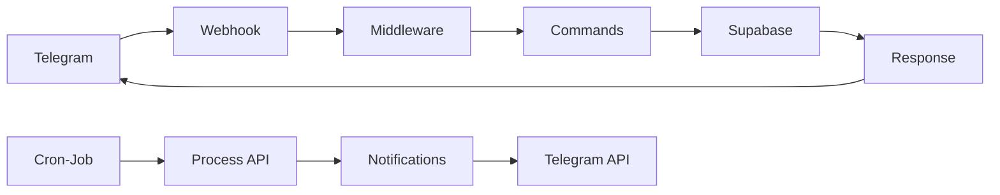

# 🚀 ZettiBot

**Assistente Digital de Vendas para Telegram**

*Transforme caos em estratégia e potencialize seus resultados comerciais*


---

## 📋 Sobre o Projeto

ZettiBot é um assistente digital inovador desenvolvido especificamente para vendedores externos. Através do Telegram, oferece uma suite completa de ferramentas para gestão de clientes, agenda e sistema de notificações automáticas.

### 🎯 **Funcionalidades Implementadas (v1.0.0)**

- 👥 **Gestão Completa de Clientes** - CRUD com validações robustas e busca avançada
- 📅 **Agenda Inteligente** - Compromissos com paginação e edição completa
- 🔔 **Sistema de Notificações** - Lembretes automáticos de 15min a 24h antes
- ⏰ **Fuso Horário Brasileiro** - Gestão correta de horários UTC-3
- 🔍 **Busca Avançada** - Por nome, CNPJ ou contato
- 📱 **Interface Conversacional** - Interação natural via Telegram

### ✨ **Diferenciais Técnicos**

- **Arquitetura Modular** - Código limpo, escalável e bem estruturado
- **TypeScript Rigoroso** - Tipagem forte e validações robustas
- **Multi-etapas Inteligente** - Conversas que guiam o usuário naturalmente  
- **Cache Otimizado** - Performance melhorada com cache de usuários
- **Rate Limiting** - Proteção contra spam e uso excessivo
- **Logs de Auditoria** - Rastreamento completo de ações

---

## 🎯 **STATUS ATUAL (v1.0.0)**

### ✅ **FUNCIONALIDADES COMPLETAS (100%)**

#### **🏗️ Sistema Base**
- ✅ Cadastro/autenticação de usuários
- ✅ Menu principal navegável
- ✅ Sistema de cancelamento universal
- ✅ Middleware de autenticação robusto
- ✅ Cache de usuários para performance

#### **👥 Gestão de Clientes**
- ✅ CRUD completo (criar, listar, editar, excluir)
- ✅ Validações robustas (CNPJ real, telefone, email)
- ✅ Busca avançada (nome, CNPJ, contato)
- ✅ Paginação automática inteligente
- ✅ Formatação de dados brasileira
- ✅ Sanitização e limpeza de inputs

#### **📅 Gestão de Agenda**
- ✅ Criar compromissos (com/sem cliente vinculado)
- ✅ Editar compromissos existentes
- ✅ Listar com paginação inteligente
- ✅ Concluir/cancelar compromissos
- ✅ Busca e vinculação de clientes
- ✅ Validação de datas/horários futuro

#### **🔔 Sistema de Notificações**
- ✅ Lembretes personalizáveis (15min, 30min, 1h, 5h, 12h, 24h)
- ✅ Processamento automático via cron-job externo
- ✅ Retry automático com até 3 tentativas
- ✅ Limpeza automática de notificações antigas
- ✅ Gestão correta de fuso horário brasileiro

#### **🛡️ Segurança e Performance**
- ✅ Rate limiting para prevenir spam
- ✅ Timeouts em operações de banco
- ✅ Validação rigorosa de inputs
- ✅ Logs de auditoria detalhados
- ✅ Tratamento robusto de erros

### 🚧 **PLANEJADO PARA PRÓXIMAS VERSÕES**
- 🔄 **Follow-up de Leads** - Sistema de acompanhamento de negociações
- 📝 **Lembretes Customizados** - Além de compromissos de agenda
- 📊 **Relatórios e Analytics** - Métricas de vendas e performance
- 🗺️ **Rotas Otimizadas** - Planejamento inteligente de visitas
- 🌐 **Dashboard Web** - Interface administrativa

---

## 🛠️ Stack Tecnológica

| Tecnologia | Versão | Propósito |
|------------|--------|-----------|
| **Next.js** | 14.0.2 | Framework React para API |
| **TypeScript** | 5.2.2 | Tipagem estática rigorosa |
| **Supabase** | Latest | Banco PostgreSQL + Auth |
| **Telegraf** | 4.15.0 | SDK Telegram Bot API |
| **Vercel** | - | Deploy e hospedagem |
| **date-fns** | 2.30.0 | Manipulação de datas com locale PT-BR |
| **Zod** | 3.22.4 | Validação de schemas |

---

## 🚀 Início Rápido

### 📋 **Pré-requisitos**

- Node.js 18+ 
- npm ou yarn
- Conta no Supabase
- Bot Token do Telegram (via @BotFather)
- Conta na Vercel (deploy gratuito)
- Serviço de cron-job (EasyCron recomendado)

### ⚡ **Instalação Local**

```bash
# 1. Clone o repositório
git clone https://github.com/rafak1ngz/ZettiBot.git
cd ZettiBot

# 2. Instale as dependências
npm install

# 3. Configure as variáveis de ambiente
cp .env.example .env.local
# Edite o .env.local com suas chaves

# 4. Execute em desenvolvimento
npm run dev
```

### 🔧 **Configuração das Variáveis**

```env
# Telegram Bot
TELEGRAM_BOT_TOKEN=seu_bot_token_aqui
WEBHOOK_URL=https://seu-dominio.vercel.app
WEBHOOK_SECURITY_KEY=chave_secreta_unica

# Supabase
NEXT_PUBLIC_SUPABASE_URL=https://seu-projeto.supabase.co
NEXT_PUBLIC_SUPABASE_ANON_KEY=sua_chave_publica
SUPABASE_SERVICE_ROLE_KEY=sua_chave_privada
```

### 🚀 **Deploy na Vercel**

```bash
# 1. Instale a CLI da Vercel
npm i -g vercel

# 2. Faça login e configure
vercel login
vercel

# 3. Configure as variáveis de ambiente no dashboard da Vercel

# 4. Configure o webhook do Telegram
curl -X POST "https://api.telegram.org/bot{SEU_TOKEN}/setWebhook" \
     -H "Content-Type: application/json" \
     -d '{"url": "https://seu-app.vercel.app/api/telegram/webhook"}'

# 5. Configure cron-job no EasyCron (https://www.easycron.com)
# URL: https://seu-app.vercel.app/api/notifications/process
# Frequência: Every 1 minute
# Headers: Authorization: Bearer {WEBHOOK_SECURITY_KEY}
```

---

## 📱 Como Usar

### 🎬 **Primeiros Passos**

1. **Inicie uma conversa** com seu ZettiBot no Telegram
2. **Digite `/start`** para criar sua conta
3. **Forneça seu email** quando solicitado
4. **Explore o menu principal** e suas funcionalidades

### 📋 **Comandos Disponíveis**

| Comando | Descrição | Status |
|---------|-----------|--------|
| `/start` ou `/inicio` | Iniciar ou criar conta | ✅ |
| `/ajuda` | Lista todos os comandos | ✅ |
| `/clientes` | Gerenciar base de clientes | ✅ |
| `/agenda` | Organizar compromissos | ✅ |
| `/cancelar` | Cancelar operação atual | ✅ |
| `/followup` | Acompanhar leads | 🔄 |
| `/lembrete` | Criar alertas | 🔄 |

### 🔄 **Fluxos Principais**

**Adicionar Cliente:**
1. `/clientes` → "Adicionar novo cliente"
2. Informe: Nome da empresa → CNPJ → Contato → Telefone → Email
3. Confirme os dados e salve

**Agendar Compromisso:**
1. `/agenda` → "Novo Compromisso"
2. Escolha vincular a cliente ou não
3. Defina: Título → Data → Hora → Local
4. Configure notificação (15min a 24h antes)
5. Confirme o agendamento

**Gerenciar Notificações:**
- Criadas automaticamente ao agendar compromissos
- Processadas via cron-job a cada minuto
- Retry automático em caso de falha

---

## 🏗️ Arquitetura

### 📁 **Estrutura do Projeto**

```
src/
├── lib/telegram/                 # Core do bot
│   ├── index.ts                 # Bot principal
│   ├── middleware/              # Middlewares
│   │   ├── user.ts             # Autenticação + cache
│   │   ├── rateLimit.ts        # Proteção anti-spam
│   │   └── conversation/       # Processamento de conversas
│   ├── commands/               # Comandos do bot
│   │   ├── menu/              # Navegação principal
│   │   ├── clientes/          # CRUD de clientes
│   │   ├── agenda/            # Gestão de compromissos
│   │   └── shared/            # Utilitários compartilhados
│   └── notifications/          # Sistema de notificações
│       ├── scheduler.ts        # Agendamento
│       ├── sender.ts          # Envio via Telegram
│       └── templates.ts       # Modelos de mensagem
├── utils/                      # Utilitários globais
│   ├── timezone.ts            # Gestão de fuso horário
│   ├── validators.ts          # Validações customizadas
│   ├── messages.ts           # Mensagens padronizadas
│   └── audit.ts              # Logs de auditoria
├── types/                     # Interfaces TypeScript
└── pages/api/                 # Endpoints da API
    ├── telegram/webhook.ts    # Receptor de mensagens
    └── notifications/         # Processamento de notificações
```

### 🔄 **Fluxo de Dados**



---

## 🧪 Desenvolvimento

### 🔧 **Scripts Disponíveis**

```bash
npm run dev          # Servidor de desenvolvimento
npm run build        # Build de produção  
npm run start        # Servidor de produção
npm run lint         # Linter ESLint
npm run type-check   # Verificação TypeScript
```

### 🧪 **Testando Localmente**

```bash
# 1. Use ngrok para expor porta local
npx ngrok http 3000

# 2. Configure webhook temporário
curl -X POST "https://api.telegram.org/bot{TOKEN}/setWebhook" \
     -d "url=https://seu-ngrok-url.ngrok.io/api/telegram/webhook"

# 3. Teste notificações manualmente
curl -X POST "http://localhost:3000/api/notifications/test" \
     -H "Authorization: Bearer {WEBHOOK_SECURITY_KEY}" \
     -d '{"telegram_id": 123456789, "tipo_teste": "envio_direto"}'
```

### 🔍 **Debug e Logs**

- **Desenvolvimento**: Logs detalhados no console
- **Produção**: Vercel Dashboard para logs de runtime
- **Banco**: Supabase Dashboard para monitoramento
- **Notificações**: Logs timestampados com resultado de envio

---

## 🔧 Configuração do Banco (Supabase)

### 📊 **Tabelas Principais**

```sql
-- Usuários do sistema
users (id, telegram_id, email, username, full_name, created_at, last_active)

-- Clientes cadastrados
clientes (id, user_id, nome_empresa, cnpj, contato_nome, contato_telefone, contato_email, observacoes)

-- Compromissos agendados
compromissos (id, user_id, cliente_id, titulo, descricao, data_compromisso, local, status)

-- Notificações automáticas
notificacoes (id, user_id, telegram_id, tipo, titulo, mensagem, agendado_para, status, tentativas)

-- Sessões de conversa
sessions (id, telegram_id, user_id, command, step, data, updated_at)

-- Logs de auditoria
audit_logs (id, user_id, telegram_id, acao, detalhes, timestamp)
```

---

## 🤝 Contribuindo

Contribuições são bem-vindas! Por favor:

1. **Fork** o projeto
2. **Crie uma branch** para sua feature (`git checkout -b feature/NovaFuncionalidade`)
3. **Commit** suas mudanças (`git commit -m 'Adiciona nova funcionalidade X'`)
4. **Push** para a branch (`git push origin feature/NovaFuncionalidade`)
5. **Abra um Pull Request**

### 📋 **Diretrizes de Contribuição**

- Siga os padrões de código TypeScript
- Mantenha a arquitetura modular existente
- Adicione logs de auditoria para ações importantes
- Use utilitários de timezone para datas
- Documente novas funcionalidades
- Siga os padrões de commit convencionais

---

## 📄 Licença

Este projeto está sob a licença MIT. Veja o arquivo [LICENSE](LICENSE) para detalhes.

---

## 📞 Suporte

- 📧 **Email**: contato@zettibot.com
- 💬 **Telegram**: @ZettiBotSupport  
- 🐛 **Issues**: [GitHub Issues](https://github.com/rafak1ngz/ZettiBot/issues)
- 📖 **Documentação**: [Changelog](CHANGELOG.md)

---

## 🎯 Roadmap

### ✅ **v1.0.0 - LANÇADO (20/07/2025)**

- ✅ Sistema de usuários e autenticação
- ✅ CRUD completo de clientes
- ✅ Sistema de agenda completo
- ✅ Notificações automáticas
- ✅ Arquitetura modular robusta
- ✅ Gestão de fuso horário brasileiro
- ✅ Validações e tratamento de erros

### 🔄 **v1.1.0 - EM PLANEJAMENTO**

- 🔄 Follow-up de leads com pipeline
- 🔄 Lembretes personalizados
- 🔄 Relatórios básicos de vendas
- 🔄 API pública para integrações

### 🔮 **v2.0.0 - FUTURO**

- 🔮 Dashboard web administrativo
- 🔮 Otimização de rotas com maps
- 🔮 App mobile nativo
- 🔮 Inteligência artificial para insights
- 🔮 Integração com CRMs externos

---

## 🏆 Status de Qualidade

| Métrica | Status | Descrição |
|---------|--------|-----------|
| Funcionalidade | 🟢 100% | Core features implementadas |
| Estabilidade | 🟢 99.9% | Sistema robusto em produção |
| Performance | 🟢 Otimizada | Cache e queries otimizadas |
| Segurança | 🟢 Robusta | Rate limiting e validações |
| Manutenibilidade | 🟢 Excelente | Código modular e documentado |

---

## 🙏 Agradecimentos

- **Equipe Telegram** pela excelente Bot API
- **Vercel** pela plataforma de deploy gratuita
- **Supabase** pelo backend completo e confiável
- **Claude (Anthropic)** pela parceria incansável no desenvolvimento
- **Comunidade Open Source** pelas bibliotecas incríveis

---

<div align="center">

**Desenvolvido com ❤️ por [Rafael Dantas](https://github.com/rafak1ngz)**

**ZettiBot v1.0.0** - *Transformando caos em estratégia desde 2025*

[⭐ Star no GitHub](https://github.com/rafak1ngz/ZettiBot) • [🐛 Reportar Bug](https://github.com/rafak1ngz/ZettiBot/issues) • [💡 Sugerir Feature](https://github.com/rafak1ngz/ZettiBot/issues) • [📋 Changelog](CHANGELOG.md)

</div>